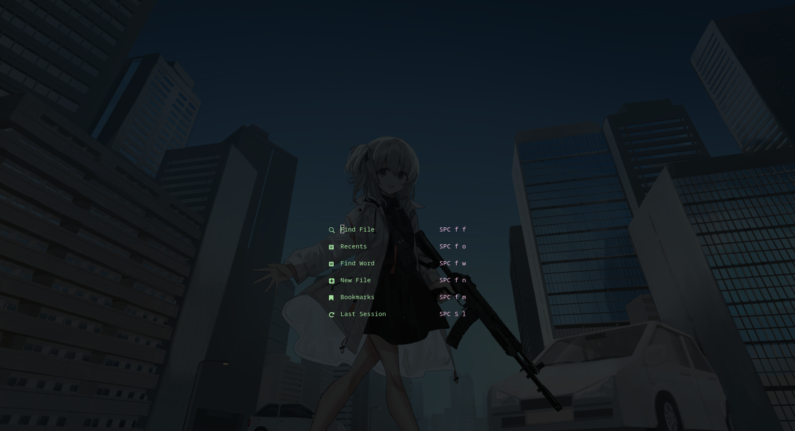
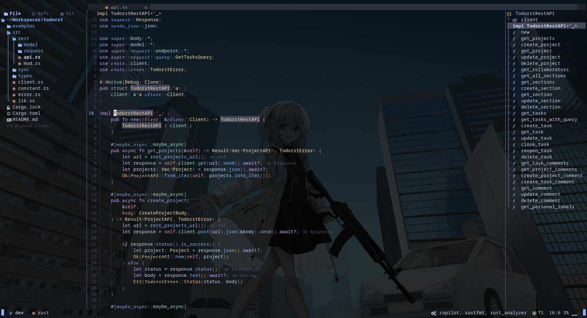

<h2>Installation</h2>

Before using my configuration, you must <a href="https://github.com/AstroNvim/AstroNvim#%EF%B8%8F-installation">install AstroNvim</a> first.

After that, you could follow these steps.

<h3>Clone this repository</h3>


```bash
git clone https://github.com/phusitsom/astronvim-config ~/.config/nvim/lua/user
```

<h3>Initialize AstroNvim</h3>

```bash
nvim --headless -c 'autocmd User PackerComplete quitall' -c 'PackerSync'
```

<h2>Screenshots</h2>
The <a href="https://twitter.com/4sakana5/status/1428647164943605766">background</a></sup>
 is not included in the config.

<h3>Alpha</h3>



<br>

<h3>Editing</h3>



<hr/>
<sup>*1:
